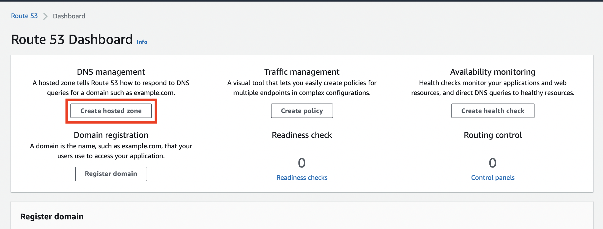

# Prerequisites

## Register a Domain

For example with [Hover](https://hover.com).

## Create a Hosted Zone for the domain

In the AWS Console, create a Hosted Zone for the domain

## Set the NS records in your domain registrar

Obtain the NS records in the Route 53 zone and copy them in your domain registrar

## Install CDK CLI
- [Install CDK CLI](https://sergiodelamo.com/blog/install-aws-cdk.html)

## Deployment 
- Login into your AWS account with `aws configure`.
- `cd infra`
- If this is an AWS account where you never run CDK. Run `cdk bootstrap`
- `cdk deploy`